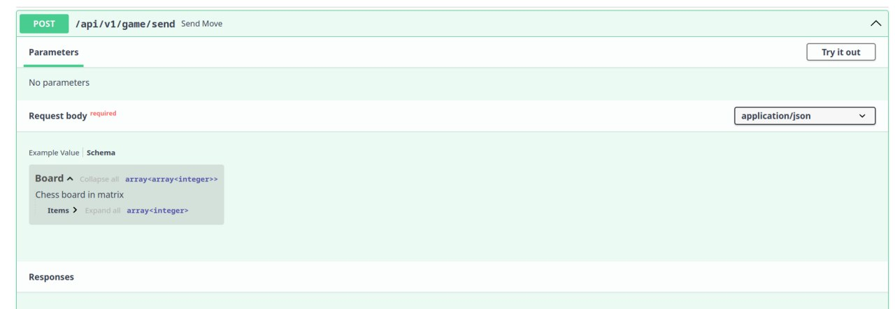
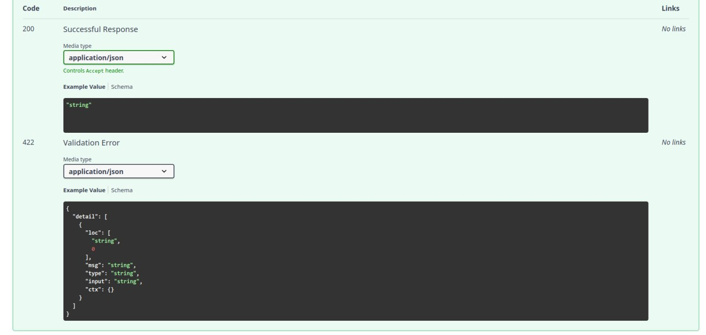
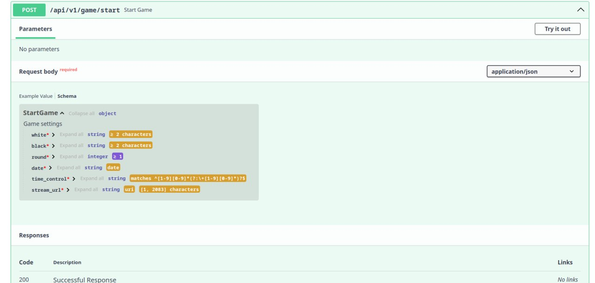
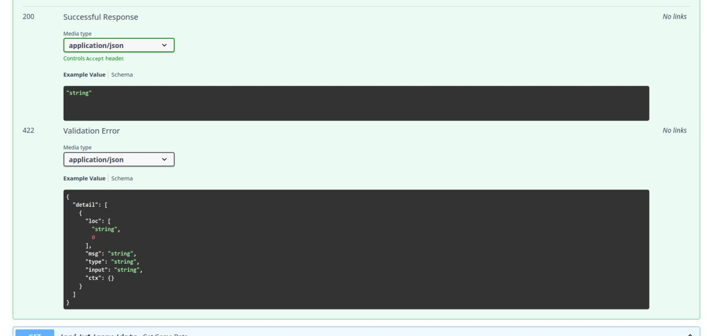
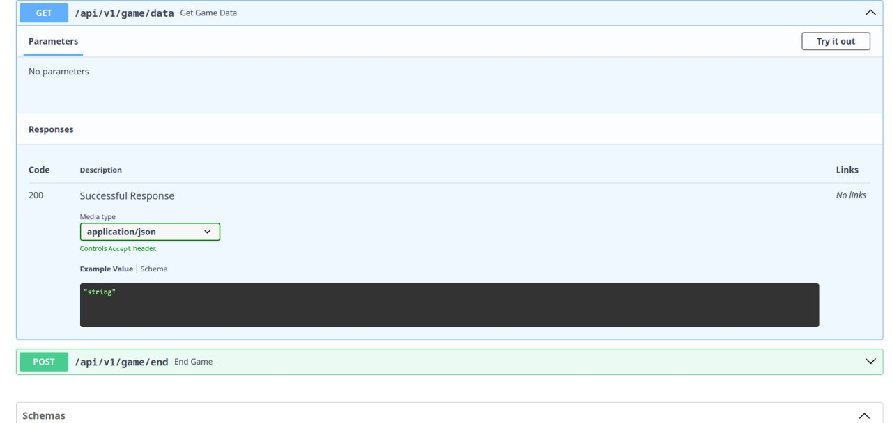
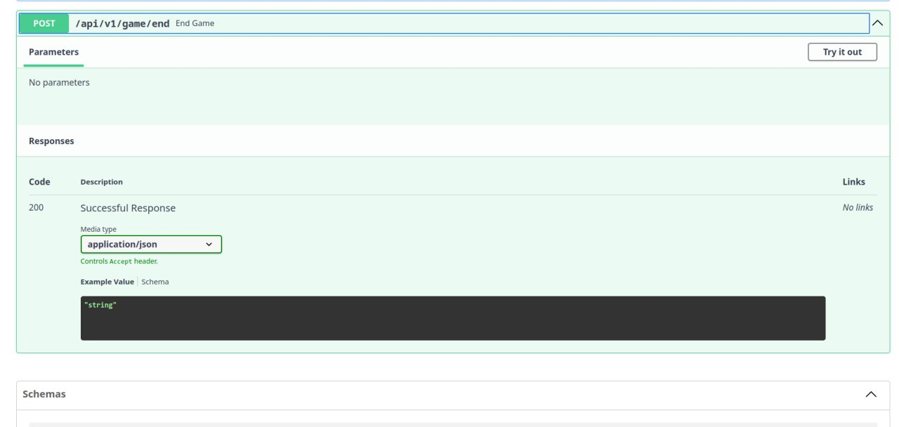

# Chess Capital Backend

## Ну тащемта всё у Серёги спиздить можешь. А если конкретно

### Установка uv

```bash
curl -LsSf https://astral.sh/uv/install.sh | sh
```

### Установка зависимостей

```bash
uv venv -seed
uv sync
```

### Запуск

```bash
uv run uvicorn main:app --host 127.0.0.1 --port 8080 # Порт замени на свободный какой-нибудь
```

## С В А Г А







